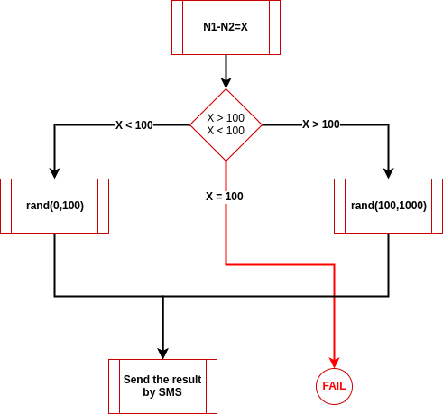
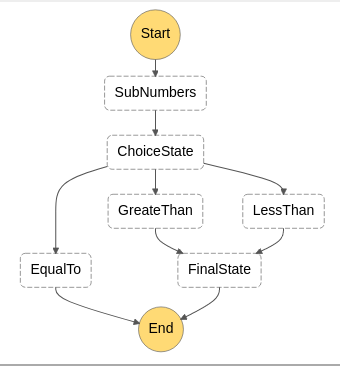
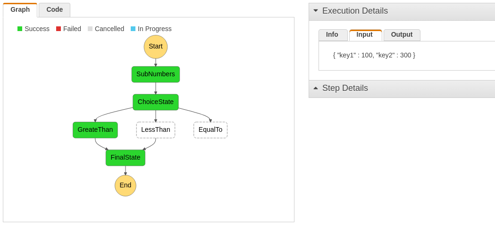
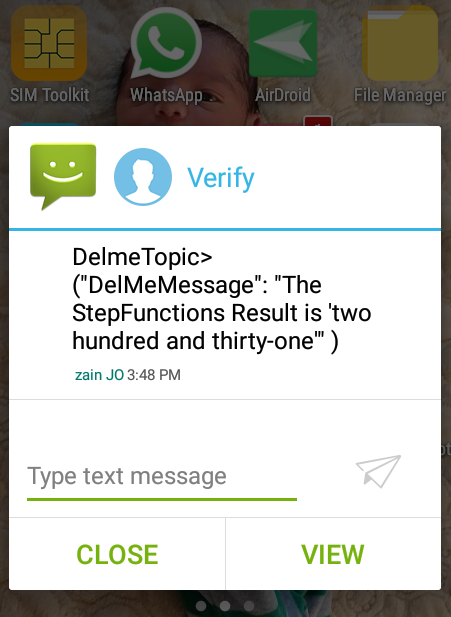

# AWS Step Functions
"AWS Step Functions is a web service that enables you to coordinate the components of distributed applications and microservices using visual workflows. You build applications from individual components that each perform a discrete function, or task, allowing you to scale and change applications quickly."
 
I've learned Step Functions by applying the following example and I hope it can help you in 
 
# Algorithm (Example)
In this example, the algorithm takes two input numbers and subtract them,then : 
- If the result is larger than 100 the user should receive a SMS with a random number between 100-1000. 
- If it's less, then the random number in the SMS should be from 0-100.
- Else it's failed scenario, with a dead end.
 
<p align="center">
 
</p>
 
In step functions, you can consider that each process block is an AWS Lambda Function, that takes the output of previous state as input for the current state. Therefore we have 4 Lambda functions in this example: 
- sub_numbers_lambda | takes { key1 : X, key2 : Y} and returns { number : Z }
- greater_than_lambda | returns { final_number : rand(100,100) }
- less_than_lambda | returns { final_number : rand(0,100) }
- final_state_lambda | takes { final_number : C } 
 
Step functions are described with json format, where you should define :
- start_state (StartAt)
- final_state (End)
- next_state (Next)
- choise_state ( Type : Choice), which supports many comparison operators. 
 
# Step Functions Description Example
```
"StartAt": "SubNumbers",
  "States": {
    "SubNumbers": {
      "Type": "Task",
      "Resource": "ARN:OF:sub-numbers",
      "Next": "ChoiceState"
    },
    "ChoiceState": {
      "Type" : "Choice",
      "Choices": [
        {
          "Variable": "$.number",
          "NumericGreaterThan": 100,
          "Next": "GreateThan"
        },
        {
          "Variable": "$.number",
          "NumericEquals": 100,
          "Next": "LessThan"
        }
      ],
      "Default": "EqualTo"
    },
 
    "GreateThan": {
      "Type" : "Task",
      "Resource": "ARN:OF:greater-than-lambda",
      "Next": "FinalState"
    },
 
    "LessThan": {
      "Type" : "Task",
      "Resource": "ARN:OF:less-than-lambda",
      "Next": "FinalState"
    },
 
    "EqualTo": {
      "Type": "Fail",
      "Cause": "No Matches!",
      "End": true
    },
 
    "FinalState": {
      "Type": "Task",
      "Resource": "ARN:OF:final-state-lambda",
      "End": true
    }
  }
}
```
 
# Apply it
1- Clone this repo
2- Create a python virtualenv inside it, and install pip requirements
```
$ git clone git@github.com:OsamaJBR/teach-me-aws-stepfunctions.git
$ cd teach-me-aws-stepfunctions
$ virtualenv env
$ source env/bin/activate
$ pip install -r requirement.txt
```
3- Start deploying functions using [Zappa](https://github.com/Miserlou/Zappa)
```
$ cd sub_numbers_lambda; zappa deploy develop
$ cd greater_than_lambda; zappa deploy develop
$ cd less_than_lambda; zappa deploy develop
```
4- Go to Amazon Console (AWS Lambda) page and get all ARN for the above lambda functions
5- Edit steps.json file and add ARN inside the related state definition
```
...
"SubNumbers": {
   "Type": "Task",
   "Resource": "XXXXXXXXXXXX",
   "Next": "ChoiceState"
},
...
```
6- Edit final_state_lambda by adding the SNS Topic ARN in the code, then deploy the function using zappa again
```
$ cd final_state_lambda; vim handle.py
...
response = client.publish(
   TargetArn="XXXXXXXXXXXXXXX",
   Message=json.dumps({'default': json.dumps(message)}),
   MessageStructure='json'
)
...
$ zappa deploy develop
```
7- Go to Amazon Step Function page, the Create State Machine. Past the edited steps.json inside the Code panel. Then you should see this in the Preview section.
<p align="center">
 
</p>
* If everything is ok, create it.
 
# How to test it
1- Go to the new state machine, and press on new execution.
2- Insert the following as input, and start the execution.
```
{
 "key1" : 100,
 "key2" : 300
}
```
<p align="center">
 
</p>
3- The final state suppose to send an SMS to the phone number subscribed in the SNS Topic.
<p align="center">
 
</p>
 
 
 
